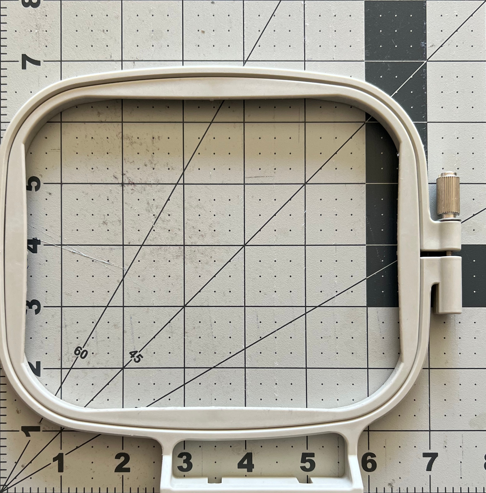
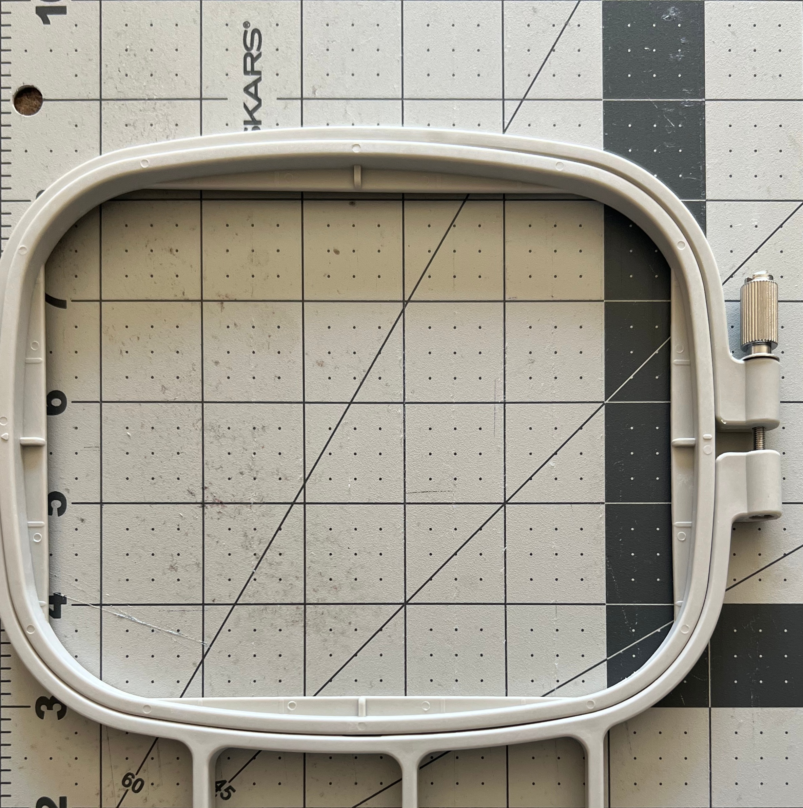
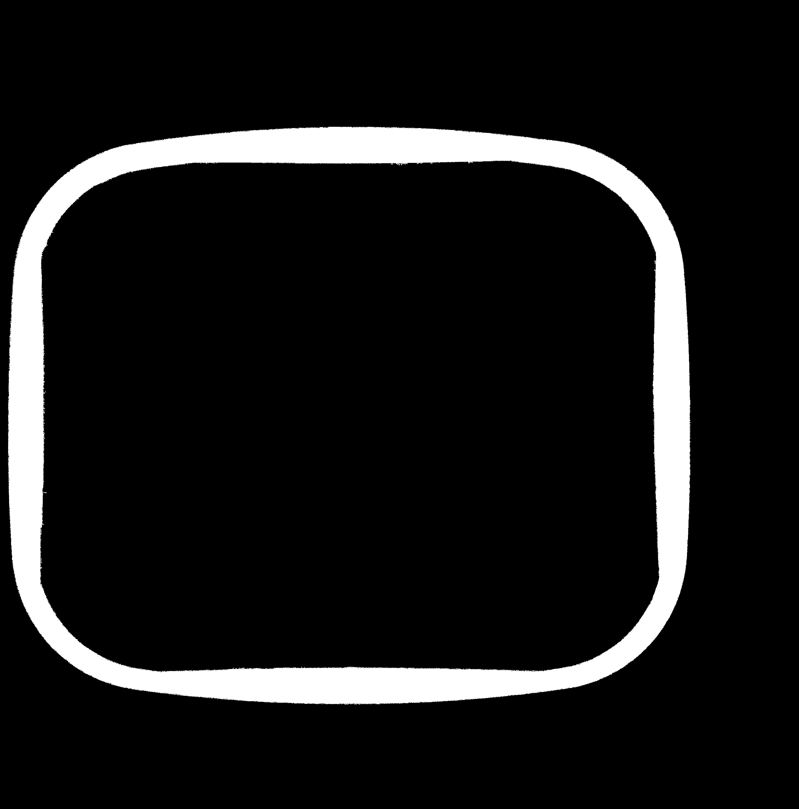
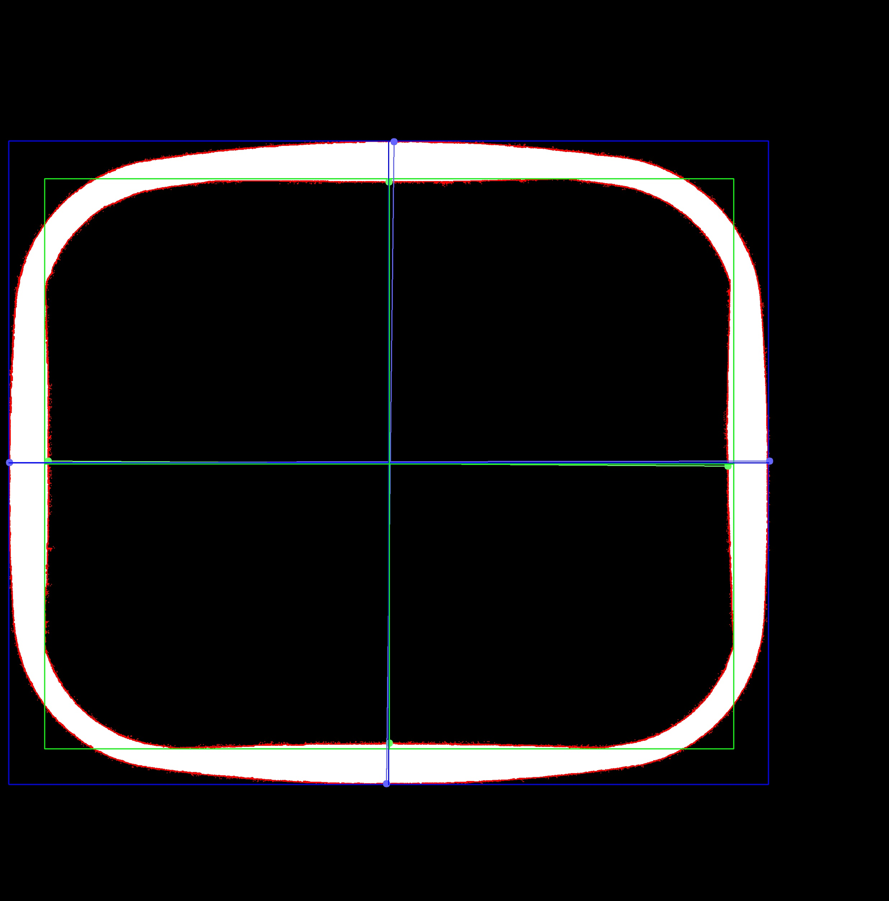
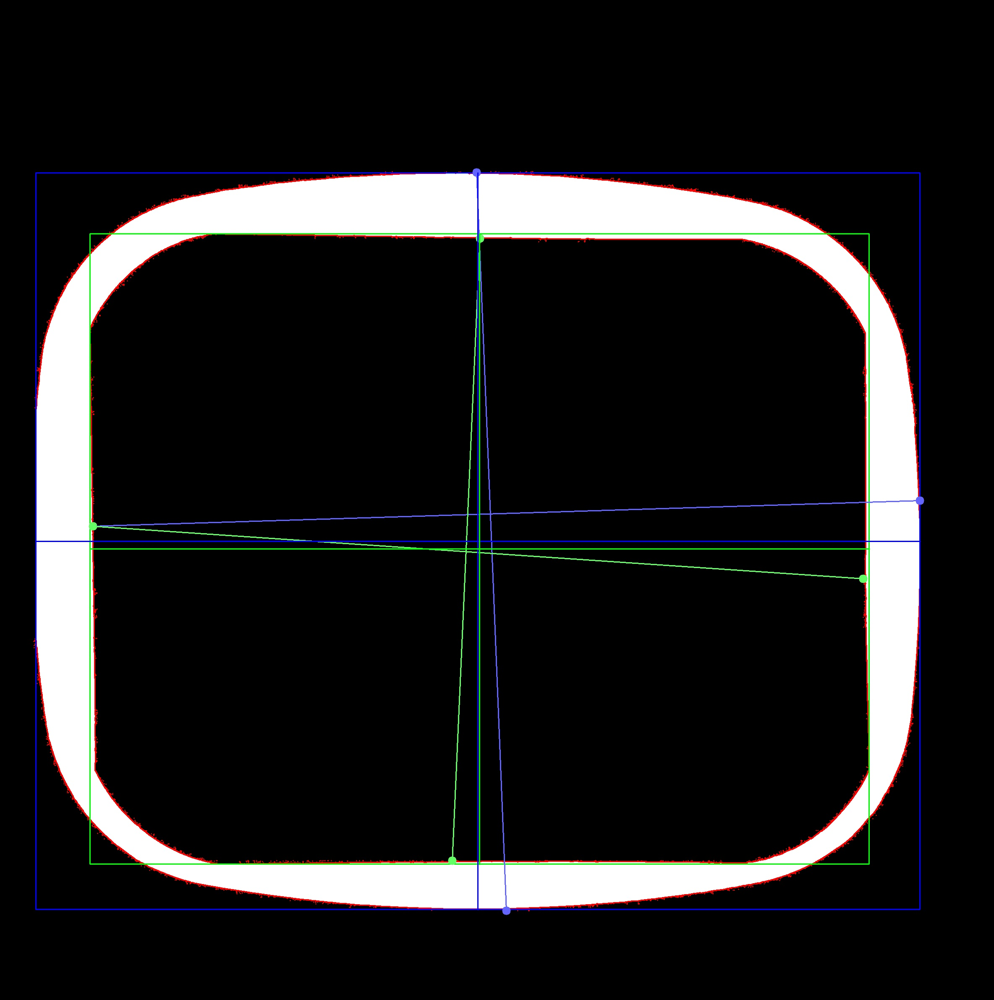

# Reverse Brother

A reverse engineering project for my mom.

# Table of Contents

- [Introduction](#introduction)
- [Process](#process)
  - [4x4 Inner/Outer Pixel Results](#4x4-innerouter-pixel-results)
  - [5x7 Inner/Outer Pixel Results](#5x7-innerouter-pixel-results)
- [Related Brother Models](#related-brother-models)

# Introduction

My mom asked for custom inserts for her embroidery machine. This project documents my process of reverse engineering the insert by applying pixel math and computer vision.

# Process

I asked her for a photo of the hoop with a coin for scale. She suggested using her fiskars cutting mat for scale.

> 4x4 hoop

> 5x7 hoop

I used paint.net to get some pixel measurements and then applied a perspective transformation to the image.

> 4x4 perspective transformed

> 5x7 perspective transformed

I'd then convert the image to grayscale and applied a canny edge detection.

> 4x4 canny edge detection

> 5x7 canny edge detection

I manaually edited the image to highlight the insert.

> 4x4 segmented

> 5x7 segmented

Then I computed the outer and inner contours and bounding boxes.

> 4x4 final

> 5x7 final

From there I computed the outer and inner width and height.

## 4x4 Inner/Outer Pixel Results

| Name | px | in |
| --- | --- | --- |
| outer_w | 2118 | 6.76 |
| outer_h | 1792 | 5.79 |
| inner_w | 1920 | 6.12 |
| inner_h | 1588 | 5.13 |

## 5x7 Inner/Outer Pixel Results

| Name | px | in |
| --- | --- | --- |
| outer_w | 2107 | 7.08 |
| outer_h | 1754 | 5.93 |
| inner_w | 1857 | 6.24 |
| inner_h | 1501 | 5.07 |

# Related Brother Models

- https://www.printables.com/model/1098088-frame-embroidery-brother
- https://www.printables.com/model/113832-embroidery-sock-frame
- https://www.printables.com/model/461826-embroidery-sock-frame-for-brother-4in-10cm-hoop
- https://www.printables.com/model/691978-brother-embroidery-inner-hoop
- https://www.printables.com/model/463204-spinning-thread-holder-and-hoop-for-brother-embroi
- https://www.printables.com/model/430164-sewing-machine-spool-holder-brand-brother
- https://pinshape.com/items/7134-3d-printed-brother-embroidery-machine-5x7-inner-hoop
- https://www.thingiverse.com/thing:4794785
